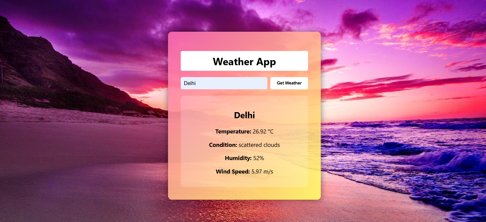

# Weather App – PRODIGY_WD_05

A clean and responsive weather application that fetches real-time weather data using the OpenWeatherMap API. Users can check weather conditions by entering any city name. The app displays temperature, humidity, wind speed, and overall weather conditions with an aesthetic UI.

---

## 🌐 Features

- Real-time weather data
- Clean, mobile-responsive UI
- Integrated with OpenWeatherMap API
- Beautiful galaxy-themed background
- Styled weather container with gradient tones (pink/yellow)
- Minimal and modern UX

---

## 🛠️ Built With

- **HTML5**
- **CSS3** – responsive design with gradients and background images
- **JavaScript** – fetch API, async/await

---

## 📷 Screenshots

 <!-- Optional: Add if you take a screenshot of your app -->

---

## 🚀 How to Run

1. Clone the repository:
   ```bash
   git clone https://github.com/barbiem29/PRODIGY_WD_05.git
   cd PRODIGY_WD_05
